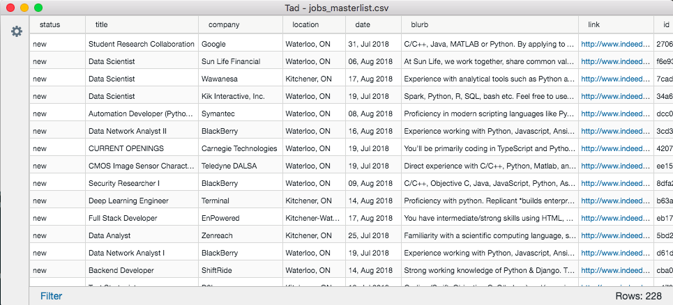

## [JobFunnel](https://github.com/PaulMcInnis/JobFunnel)

Tool for scraping job websites, filtering job listings, and reviewing them in Python.

- Added proxy support for scraping to hide your IP address.
- Developed validation procedures for the configuration script.
- Set up a unit-test framework and refactored parts of the codebase to support testing.

## [ghoR](https://github.com/markkvdb/ghoR)

R package for downloading WHO datasets using their GHO API with data transformation and saving tools.

- Set up the skeleton for a complete R package including unit tests and automatic documentation generation.
- Created automatic database detection to prevent downloading the same dataset multiple times.

## [MDSDHVRP-Solver](https://github.com/markkvdb/MDSDHVRP-Solver)

High-performance metaheuristic algorithm in C++ for a vehicle routing problem with multiple depots and split-delivery support.

- Performed extensive profiling analysis to find algorithm bottlenecks.
- Made major contributions in an object-oriented codebase.
